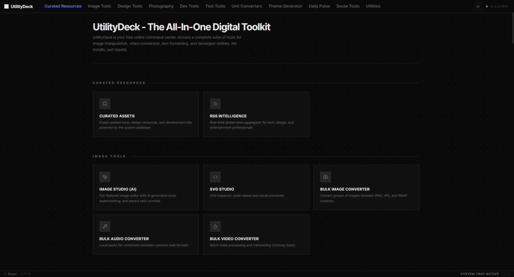

<div align="center">
  
  <h1>UtilityDeck</h1>
  <p><strong>The All-In-One Digital Toolkit | Vibe-Coded with Google AI</strong></p>

  <p>
    <a href="https://utilitydeck.subramanian.xyz/">View Live Demo</a> •
    <a href="https://github.com/yourusername/utility-deck/issues">Report Bug</a> •
    <a href="https://github.com/yourusername/utility-deck/pulls">Request Feature</a>
  </p>

  <p>
    
    
    
    
  </p>
</div>

<br />

## 🚀 About The Project

**UtilityDeck** is a centralized command center for all the "micro-tasks" developers and creators do daily.

We've all been there: Googling "convert png to webp," "json formatter," or "case converter" and landing on ad-heavy, spammy websites. UtilityDeck solves this by bringing every essential tool into one clean, privacy-first, ad-free dashboard.

### 🤖 The "Vibe Coding" Story
This project is an experiment in **Vibe Coding**. Instead of writing every CSS class or function by hand, I used **Google AI Studio** as a pair programmer.

* **The Process:** I described the "vibe" (dark mode, glassmorphism, card layouts) and functionality to the AI.
* **The Result:** Rapid iteration where features were built at the speed of thought.
* **The Tech:** React + Tailwind CSS + AI-generated logic.

---

## ✨ Features



UtilityDeck is packed with over 50+ tools categorized for different workflows:

### 🎨 Image & Media Studio
* **Converters:** Bulk Image (PNG/JPG/WEBP), Audio, and Video conversion.
* **Editors:** Image Resizer, Compressor, and SVG Studio.

### 🖌️ Design & Color
* **Generation:** Palette Generator, Gradient Generator, Tailwind Configurator.
* **Analysis:** Contrast Checker, Vision Simulator (Colorblindness), Image Color Extractor.
* **Reference:** Pantone History, HTML Color Names.

### 🛠️ Developer Utilities
* **Formatters:** JSON Formatter, HTML Entity Encoder.
* **Security:** MD5/SHA256 Encrypt/Decrypt, Password Generator.
* **Data:** UUID Generator, Base64 Encoder/Decoder, URL Percent Coder.
* **CSS Generators:** Flexbox, Grid, Box Shadow, and Button Generators.

### 📝 Text & Typography
* **Manipulation:** Case Converter, Whitespace Remover, String Splitter.
* **Content:** Lorem Ipsum Generator, Word Counter, Bionic Reading converter.

### 📸 Photography (Beta)
* **Calculators:** Depth of Field (DoF), Hyperfocal Distance, Diffraction Limit.
* **Astro:** 500 Rule Calculator for astrophotography.

---

## 💻 Tech Stack

* **Framework:** [React](https://reactjs.org/) (Vite)
* **Styling:** [Tailwind CSS](https://tailwindcss.com/)
* **Icons:** [Lucide React](https://lucide.dev/)
* **AI Assistance:** [Google AI Studio](https://aistudio.google.com/) (Gemini Models)

---

## ⚡ Getting Started

To run UtilityDeck locally, follow these steps:

### Prerequisites
* Node.js (v18 or higher recommended)
* npm or yarn

### Installation

1.  **Clone the repo**
    ```sh
    git clone [https://github.com/subbutvl/utility-deck.git](https://github.com/yourusername/utility-deck.git)
    ```
2.  **Install NPM packages**
    ```sh
    cd utility-deck
    npm install
    ```
3.  **Start the development server**
    ```sh
    npm run dev
    ```

The app will be available at `http://localhost:5173`.

---

## 🤝 Contributing

Contributions are what make the open-source community such an amazing place to learn, inspire, and create. Any contributions you make are **greatly appreciated**.

1.  Fork the Project
2.  Create your Feature Branch (`git checkout -b feature/AmazingTool`)
3.  Commit your Changes (`git commit -m 'Add some AmazingTool'`)
4.  Push to the Branch (`git push origin feature/AmazingTool`)
5.  Open a Pull Request

---

## 📜 License

Distributed under the MIT License. See `LICENSE` for more information.

---

## 📬 Contact

**Subramanian** - [Website](https://subramanian.xyz) - [Twitter/X](https://twitter.com/subbutvl)

Project Link: [https://github.com/yourusername/utility-deck](https://github.com/yourusername/utility-deck)
